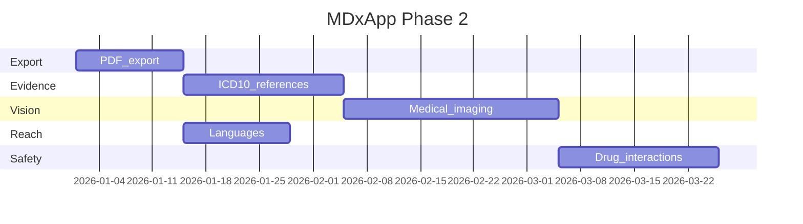

# MDxApp Product Roadmap — Implementation Plan

**Status:** Phase 2A–2E implemented (v2.5) — enable flags in secrets; set `enable_medical_imaging = true` to use vision upload  
**Order:** PDF export → Evidence / ICD-10 → Medical imaging → Languages → Drug interactions  
**Stack:** Streamlit + `src/` services + GPT-5 Mini

---

## Completed (Phase 0–1 + polish)

- Modular `DiagnosisService`, structured outputs, i18n diagnosis UI
- Confidence badges, expanders (differential + reasoning), plain-text fallback notice
- GPT-5 Mini parameter handling, tests, secrets template

---

## Phase 2A — PDF export (1–2 weeks)

**Goal:** Download a professional report after diagnosis.

### Scope

- Button: “Download PDF report” below diagnosis
- Content: patient summary + full structured sections (match on-screen layout)
- Filename: `MDxApp_diagnosis_YYYY-MM-DD_HHMM.pdf`
- No server storage (generate in-memory, Streamlit `st.download_button`)

### Technical approach

| Piece | Implementation |
|-------|----------------|
| Library | `reportlab` or `weasyprint` (HTML → PDF reuses `format_structured_diagnosis_html`) |
| Service | `src/services/pdf_export_service.py` — `build_pdf(patient, structured, translations, lang)` |
| Data | Reuse `StructuredDiagnosisOutput` + `PatientData` from session state |
| UI | [`MDxApp/01_🏥_Diagnosis_Assistant.py`](../MDxApp/01_🏥_Diagnosis_Assistant.py) — show button only when `result.success` |

### Tasks

1. Add `reportlab>=4.0` (or `weasyprint`) to `requirements.txt`
2. Implement PDF builder with logo, disclaimer, caution block
3. Unit test: PDF bytes non-empty, contains primary diagnosis string
4. Add `dx_download_pdf` to all languages in `Assets/translations.json`

### Risks

- WeasyPrint system deps on Streamlit Cloud → prefer **ReportLab** (pure Python)

---

## Phase 2B — Evidence & ICD-10 (2–3 weeks)

**Goal:** Trust and education via citations and standard codes.

### Scope

- Extend structured model with optional fields
- Link PubMed / guideline URLs when model provides PMIDs or search terms
- Display ICD-10 codes under primary + differentials

### Data model

```python
# src/core/ai_client.py
class StructuredDiagnosisOutput(BaseModel):
    ...
    icd10_primary: Optional[str] = None
    icd10_differentials: list[str] = Field(default_factory=list)
    evidence_items: list[EvidenceItem] = Field(default_factory=list)

class EvidenceItem(BaseModel):
    title: str
    source: str  # e.g. "PubMed", "WHO"
    url: Optional[str] = None
    pmid: Optional[str] = None
```

### Technical approach

| Piece | Implementation |
|-------|----------------|
| Prompts | Update `GPT5MiniPrompts.get_structured_system_prompt()` to request ICD-10 + 2–4 references |
| Validation | Pydantic; strip invalid URLs |
| Links | `https://pubmed.ncbi.nlm.nih.gov/{pmid}/` when PMID present |
| UI | New section in `render_structured_diagnosis()` — “References & codes” |
| Optional API | NCBI E-utilities for PMID lookup (rate-limited, no key for light use) |

### Tasks

1. Extend `StructuredDiagnosisOutput` (backward compatible defaults)
2. Update prompts + regression tests with mocked OpenAI parse
3. UI section + translations (`dx_icd10`, `dx_references`)
4. Document medical disclaimer: references are assistive, not prescribing

---

## Phase 2C — Medical imaging (2–4 weeks)

**Goal:** Optional image upload for vision-augmented diagnosis.

### Scope

- `st.file_uploader` — JPG, PNG, PDF (first page), max 5 MB
- Types: skin, X-ray, ECG photo, lab report photo (user selects)
- Combine image + text patient context in one GPT-5 Mini multimodal call

### Technical approach

| Piece | Implementation |
|-------|----------------|
| Client | `DiagnosisAIClient.analyze_with_image(...)` in [`src/core/ai_client.py`](../src/core/ai_client.py) |
| Model | `gpt-5-mini` vision message format (`image_url` base64) |
| Service | Extend `DiagnosisService.run()` with optional `image_bytes` |
| Output | `ImageAnalysisResult` or extend structured output with `imaging_findings` |
| Privacy | No image persistence; clear consent in UI |

### Tasks

1. File upload + validation component `src/components/image_upload.py`
2. Multimodal API method + integration tests (mock)
3. Separate system prompt for imaging (`src/core/prompts_imaging.py`)
4. Streamlit Cloud: document max upload size limits
5. Strong disclaimer: not a substitute for radiologist review

### Risks

- Higher token cost per request — show optional “estimate” in dev mode
- DICOM not supported initially (convert to PNG client-side later)

---

## Phase 2D — Language expansion (1–2 weeks)

**Goal:** Add 5 languages: Chinese (Simplified), Portuguese, Hindi, Arabic, Russian.

### Technical approach

| Piece | Implementation |
|-------|----------------|
| Translations | New keys in `Assets/translations.json` (copy English structure) |
| AI | GPT-5 Mini responds in selected language (already wired via `language` in prompts) |
| RTL | Arabic: test Streamlit RTL; add CSS if needed |
| QA | Native speaker review for medical tone |

### Tasks

1. Add language entries to `translations.json`
2. Update language selector in `src/components/language_selector.py`
3. GPT-assisted draft translations + human review checklist
4. Smoke test structured output in each language

---

## Phase 2E — Drug interaction checker (2–3 weeks)

**Goal:** Flag medication interactions when history mentions drugs.

### Scope

- Parse medications from history field (or new optional “Medications” input)
- Warnings in structured output: `drug_interactions: list[str]`
- Pregnancy/age contraindications called out

### Technical approach

| Piece | Implementation |
|-------|----------------|
| Input | Optional `medications` field on `PatientData` |
| External API | OpenFDA or RxNorm (free tiers) OR LLM-only with explicit uncertainty |
| Hybrid | API lookup + GPT-5 Mini interpretation → `InteractionReport` |
| UI | Red callout section “Medication alerts” |

### Tasks

1. Research API ToS (OpenFDA recommended for US-centric)
2. `src/services/drug_interaction_service.py`
3. Extend structured schema + prompts
4. Tests with fixed drug pairs (e.g. warfarin + aspirin)

### Risks

- Regulatory: keep “informational only” disclaimer prominent
- LLM-only interactions hallucinate — prefer API-backed when possible

---

## Suggested timeline



Languages can run **in parallel** with PDF/evidence (different files).

---

## Cross-cutting (each phase)

- Update [`EXECUTIVE_SUMMARY.md`](../EXECUTIVE_SUMMARY.md) status
- Tests in `tests/` per service
- Feature flags in `.streamlit/secrets.toml.example`
- Streamlit Cloud secrets + smoke test after deploy

---

## Decision log

| Decision | Choice | Rationale |
|----------|--------|-----------|
| PDF library | ReportLab | Streamlit Cloud friendly |
| Evidence | Structured fields first | No extra API required for MVP |
| Imaging | Optional upload | Core text flow unchanged |
| Drugs | Hybrid API + LLM | Balance accuracy and coverage |

---

## Next action

Start **Phase 2A (PDF export)** — smallest increment, reuses `StructuredDiagnosisOutput` and session state already stored as `diagnostic_structured`.
